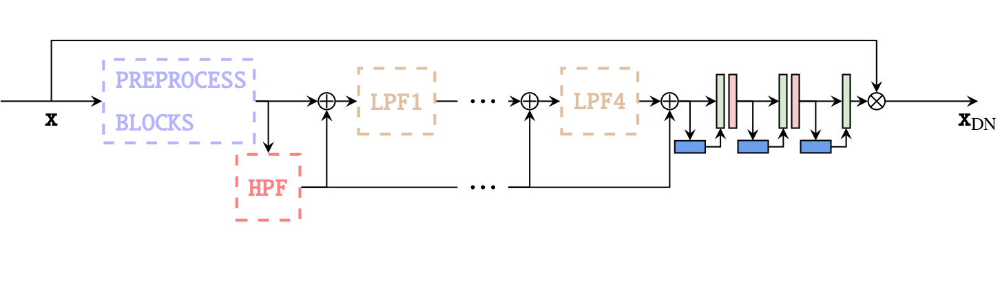
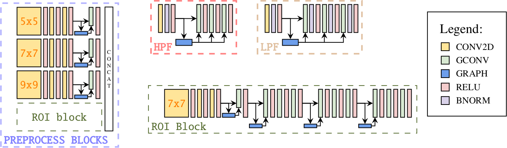
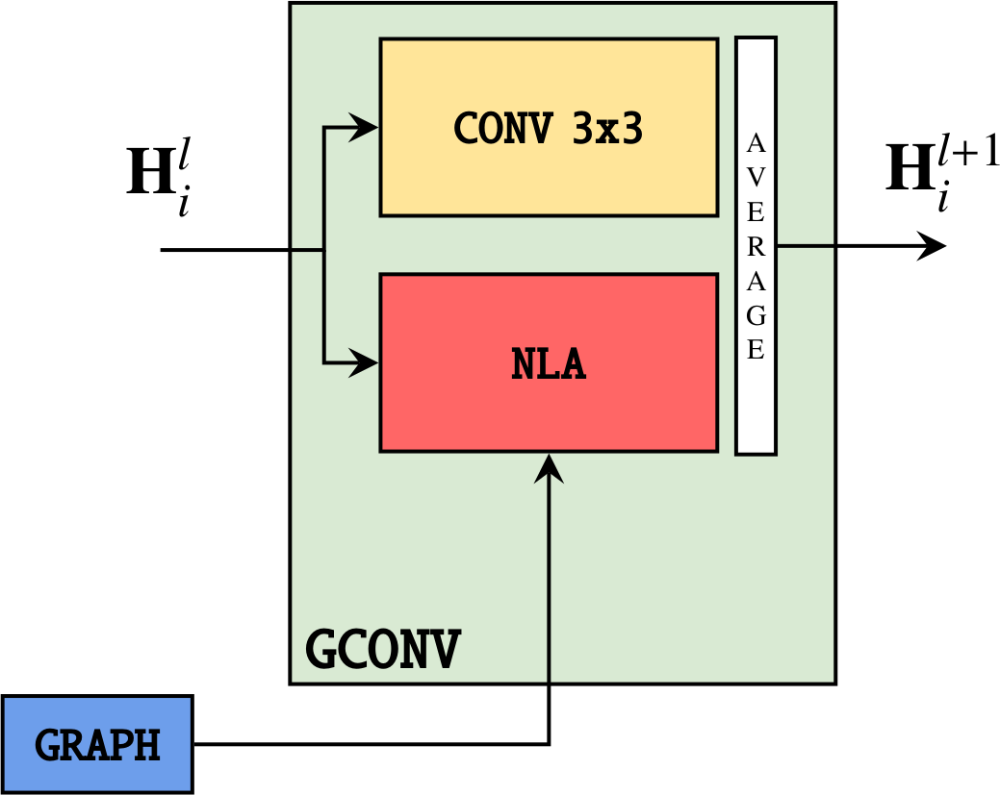

.. _gcnn-network-intro:

GCNN: Graph Convolutional Neural Network
========================================

.. image:: https://img.shields.io/badge/arXiv-hep--ph%2F2009.06635-%23B31B1B.svg
   :target: https://arxiv.org/abs/2009.06635


The GCNN network was introduced for the first time in this
`paper <https://arxiv.org/abs/1905.12281>`_. DUNEdn adapts the architecture to
work with ProtoDUNE-SP Raw Digits.


    
    The GCNN network. Preprocessing blocks output are connected to High Pass (HPF)
    and Low Pass Filters (LPF), gradually clean the inputs with the help of
    residual connections.


    
    The GCNN network blocks.

The core layer of GCNN network is the Graph Convolution operation (GCONV). Its
goal is to enhance the pixels receptive field by building a KNN-graph internally
(default is ``k=8``).


    
    The GCONV layer. The output representation is the average of a convolution
    with a *3x3* kernel and a Non Local Aggregation (NLA) operation based on the
    KNN-graph. Each pixel is connected to the *K* closest pixels in feature space.

Besides the GCNN, the DUNEdn package implements a similar network called CNN with
the same architecture as the GCNN, but exploiting regular 2-D Convolutions in
place of of Graph Convolution operations.

The experiments show that the GCNN achieves improved accuracies, at the price of
some computational speed.

Instantiating a GCNN
--------------------

High level network
``````````````````

The :ref:`inference <dunedn-class>` submodel implements classes for making
inference easily on ProtoDUNE-SP simulated event in numpy format.

Internally, the class stores two networks to process induction and collection
APAs, respectively.

The following snippet shows how to make inference with the ``DnModel``:

.. code-block:: python

    from dunedn.utils.utils import load_runcard
    from dunedn.inference.hitreco import DnModel

    settings = load_runcard("path_to_runcard.yaml")
    # modeltype can be both "cnn" or "gcnn"
    modeltype = "gcnn"
    model_setup = setup["model"][modeltype]
    network = DnModel(setup, modeltype)

Note that the network object is initialized with random weights. In order to
load weights from checkpoints, pass the ``ckpt=<folder>`` kwarg to the object
constructor.

Refer to this
`notebook <https://github.com/marcorossi5/DUNEdn/blob/onnx/examples/onnx_accuracy_example.ipynb>`_
for a usage example.

Low level network
`````````````````

A single GCNN can also be instantiated by first loading the needed setup settings
from a runcard and then calling the ``load_and_compile_gcnn_network`` function:

.. code-block:: python

    from dunedn.utils.utils import load_runcard
    from dunedn.networks.gcnn.training import load_and_compile_gcnn_network

    settings = load_runcard("path_to_runcard.yaml")
    # modeltype can be both "cnn" or "gcnn"
    modeltype = "gcnn"
    model_setup = setup["model"][modeltype]
    network = load_and_compile_gcnn_network("collection", model_setup)

The ``network`` object is of type :ref:`GcnnNet <gcnn-class>`.

GCNN submodule documentation is available at

.. toctree::
    :maxdepth: 1

    dunedn.networks.gcnn