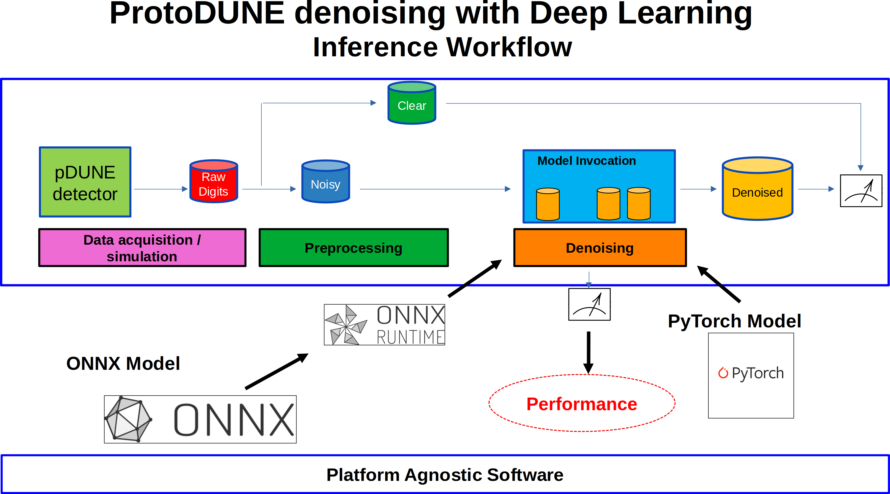

.. _onnx-intro:

DUNEdn models to Onnx format
============================

Refer to this folder
`folder <https://github.com/marcorossi5/DUNEdn/tree/onnx/examples>`_ for
examples regarding the comparison between Onnx and PyTorch networks
implementation.