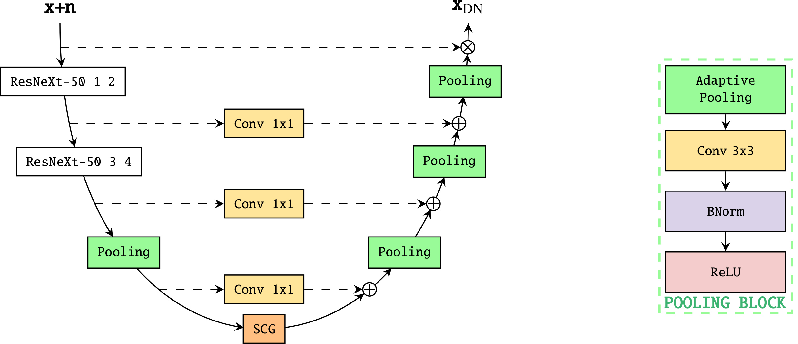
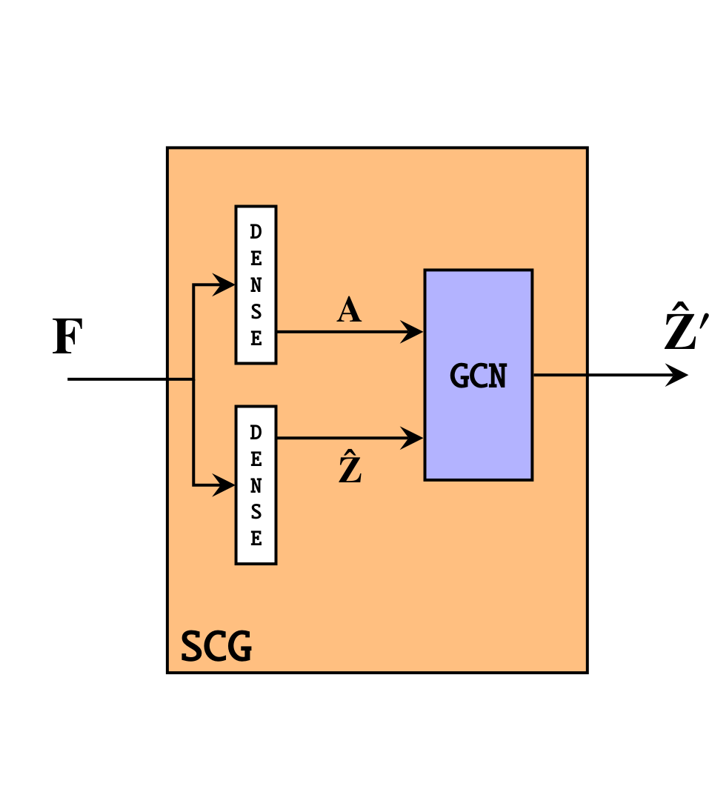

.. _uscg-network-intro:

USCG: U-shape Self Constructing Neural Network
==============================================

.. image:: https://img.shields.io/badge/arXiv-hep--ph%2F2009.06635-%23B31B1B.svg
   :target: https://arxiv.org/abs/2009.06635

The U-shape self construcing graph network has two branches that subsequently
downsample and upsample large images. The particular shape allows the Self
Constructing Graph (SCG) layer at the bottom to fit GPU memory constraints.


    
    The USCG network. Noisy input images and denoised outputs are connected by
    two branches with residual connections. 4 layers of a pretrained *ResNext-50*
    contribute to downsample the inputs.

The SCG layer was introduced for the first time by this
`paper <https://arxiv.org/abs/2009.01599>`_, it allows to build a graph
representation out of the input image. Each pixel has a receptive field that
spans all the input ones.


    
    The SCG layer. First, two fully connected layers predict the adjacency
    matrix **A** and node feature vector **Z** respectively. Then the graph is
    further analyzed by a graph network like a GCN to obtain a feature vector
    representation for each pixel in the input.

Instantiating a USCG
--------------------

High level network
``````````````````

The :ref:`inference <dunedn-class>` submodel implements classes for making
inference easily on ProtoDUNE-SP simulated event in numpy format.

Internally, the class stores two networks to process induction and collection
APAs, respectively.

The following snippet shows how to make inference with the ``DnModel``:

.. code-block:: python

    from dunedn.utils.utils import load_runcard
    from dunedn.inference.hitreco import DnModel

    settings = load_runcard("<path_to_runcard>.yaml")
    modeltype = "uscg"
    model_setup = setup["model"][modeltype]
    network = DnModel(setup, modeltype)

Note that the network object is initialized with random weights. In order to
load weights from checkpoints, pass the ``ckpt=<folder>`` kwarg to the object
constructor.

Refer to this
`notebook <https://github.com/marcorossi5/DUNEdn/blob/onnx/examples/onnx_accuracy_example.ipynb>`_
for a usage example.


Low level network
`````````````````

A single GCNN can also be instantiated by first loading the needed setup settings
from a runcard and then calling the ``load_and_compile_uscg_network`` function:

.. code-block:: python

    from dunedn.networks.uscg.training import load_and_compile_uscg_network
    from dunedn.utils.utils import load_runcard

    settings = load_runcard("path_to_runcard.yaml")
    model_setup = setup["model"]["uscg"]
    network = load_and_compile_uscg_network("collection", model_setup)

The ``network`` object is of type :ref:`UscgNet <uscg-class>`.

GCNN submodule documentation is available at

.. toctree::
    :maxdepth: 1

    dunedn.networks.uscg